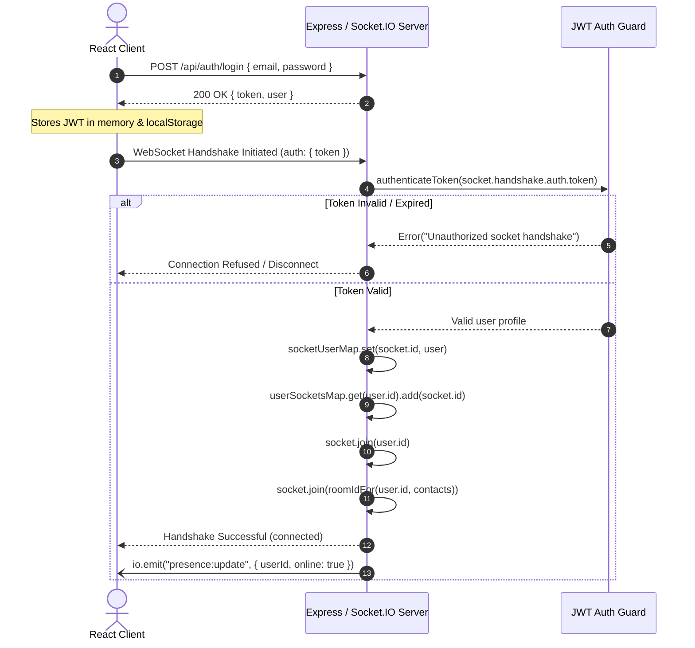
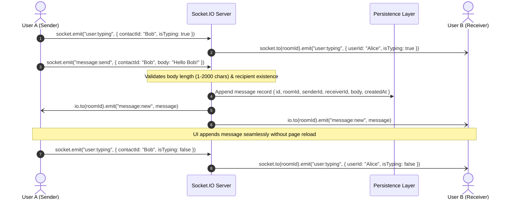

# Relay Room · Real-Time Chat Application

> **EncoderX Remote Internship — Full Stack Development Track (Week 04)**  
> **Task 4: Real-Time Chat Application Architecture & Deployment**

[](https://nodejs.org)
[](https://react.dev)
[](https://www.typescriptlang.org)
[](https://socket.io)
[](https://expressjs.com)

---

## 🔗 Quick Links

- **Live Application:** `https://relay-room-chat.onrender.com` *(Or your Render deployment link)*
- **GitHub Repository:** `https://github.com/Farhan-176/Real-Time-Chat-Application`
- **Project Demonstration Video (3–5 min):** `https://youtu.be/<your-video-id>` *(or Loom / Google Drive link)*
- **LinkedIn Post:** `https://www.linkedin.com/posts/<your-post-id>`

---

## 📖 Project Overview

**Relay Room** is a production-ready real-time communication platform engineered for team collaboration. Built from the ground up to transition traditional HTTP request-response patterns into persistent, event-driven WebSocket architectures, Relay Room provides:

- **JWT-Guarded Socket Handshake:** Complete security pipeline rejecting unauthenticated socket attempts prior to handshake completion.
- **Internal User-to-Socket Mapping:** Direct in-memory bidirectional registry tracking authenticated users and their respective active socket connections across browser tabs.
- **Deterministic Two-User Chat Rooms:** Room segregation using structured IDs (`min(u1, u2)__max(u1, u2)`) ensuring privacy and isolated event broadcasts.
- **Real-Time State Synchronization:** Dynamic message appending, active contact typing indicators, and instant network presence (online/offline) without page refreshes.
- **Persistent Message Archive:** Structured storage ensuring full message history durability across sessions with timestamps, sender, receiver, and message payload tracking.
- **Unified Production Server:** Node.js HTTP backend concurrently managing REST endpoints, WebSocket pipelines, and serving the optimized Vite React build.

---

## 🏗 Technical Architecture Summary

### High-Level System Architecture

```text
┌────────────────────────────────────────────────────────┐
│                   React + Vite Client                  │
│  - Lucide Icons & Responsive CSS Grid / Flexbox        │
│  - Socket.IO Client with persistent handshake auth     │
│  - Active state sync (Messages, Presence, Typing)      │
└──────────────────────────┬─────────────────────────────┘
                           │
             ┌─────────────┴─────────────┐
   HTTP/REST (Login, History)     WebSocket (WSS / Engine.IO)
             │                           │
┌────────────▼───────────────────────────▼───────────────┐
│               Node.js Express + Socket.IO Server       │
│  - JWT Verification Middleware (REST & Socket Handshake)│
│  - In-Memory User <-> Socket ID Map                    │
│  - Channel Room Management (`socket.join`)             │
└──────────────────────────┬─────────────────────────────┘
                           │
                           ▼
┌────────────────────────────────────────────────────────┐
│             Message Persistence Layer                  │
│  - `server/data/messages.json` (File/JSON Adapter)     │
│  - `server/schema.sql` (Relational SQL Schema)         │
└────────────────────────────────────────────────────────┘
```

---

## ⚡ Real-Time Pipeline Documentation

### 1. Connection & Handshake Authentication Lifecycle


### 2. Message Exchange & Persistence Pipeline


### 3. Disconnection & Cleanup Lifecycle
1. When a client closes the tab or loses network connectivity, Socket.IO triggers `socket.on('disconnect')`.
2. The server queries `userSocketsMap` using the socket's associated user ID.
3. The specific socket ID is removed from the user's active socket pool.
4. If no remaining active sockets exist for that user ID:
   - The user ID is removed from `onlineUsers`.
   - The server broadcasts `presence:update { userId, online: false }` to all connected clients.
   - All client contact lists immediately update their status badge without refreshing.

---

## 🗄 Database Schema Specification

Chat messages and user relationships adhere to the structured schema defined in [`server/schema.sql`](file:///e:/ongoing%20projects/REAL-TIME%20CHAT%20APPLICATION%20INTERN%20TASK/server/schema.sql):

```sql
CREATE TABLE users (
    id VARCHAR(64) PRIMARY KEY,
    name VARCHAR(255) NOT NULL,
    email VARCHAR(255) UNIQUE NOT NULL,
    role VARCHAR(100) NOT NULL,
    color VARCHAR(16) NOT NULL,
    created_at TIMESTAMP WITH TIME ZONE DEFAULT CURRENT_TIMESTAMP
);

CREATE TABLE rooms (
    room_id VARCHAR(128) PRIMARY KEY,
    user1_id VARCHAR(64) NOT NULL REFERENCES users(id) ON DELETE CASCADE,
    user2_id VARCHAR(64) NOT NULL REFERENCES users(id) ON DELETE CASCADE,
    created_at TIMESTAMP WITH TIME ZONE DEFAULT CURRENT_TIMESTAMP
);

CREATE TABLE messages (
    id UUID PRIMARY KEY,
    room_id VARCHAR(128) NOT NULL,
    sender_id VARCHAR(64) NOT NULL REFERENCES users(id) ON DELETE RESTRICT,
    sender_name VARCHAR(255) NOT NULL,
    receiver_id VARCHAR(64) NOT NULL REFERENCES users(id) ON DELETE RESTRICT,
    body TEXT NOT NULL,
    created_at TIMESTAMP WITH TIME ZONE DEFAULT CURRENT_TIMESTAMP
);

CREATE INDEX idx_messages_room_created ON messages (room_id, created_at ASC);
CREATE INDEX idx_messages_sender ON messages (sender_id);
CREATE INDEX idx_messages_receiver ON messages (receiver_id);
```

### In-Memory / File Persistent Payload Structure
```json
{
  "id": "e81d77d4-8d48-4cb5-b461-419b4cfb2c35",
  "roomId": "u-001__u-002",
  "senderId": "u-001",
  "senderName": "Maya Chen",
  "receiverId": "u-002",
  "body": "Hey Jordan, let's review the new design specs.",
  "createdAt": "2026-10-04T06:15:30.123Z"
}
```

---

## 🚀 Getting Started

### Prerequisites
- **Node.js**: `v20.0.0` or higher
- **npm**: `v9.0.0` or higher

### Local Installation
```bash
# Clone the repository
git clone https://github.com/Farhan-176/Real-Time-Chat-Application.git
cd Real-Time-Chat-Application

# Install dependencies
npm install

# Start development servers (Express backend + Vite HMR)
npm run dev
```

Visit `http://localhost:5173` in your browser.

### Seeded Demo Accounts (Password: `relay123`)

| Name | Email | Role |
| :--- | :--- | :--- |
| **Maya Chen** | `maya@relayroom.dev` | Product designer |
| **Jordan Lee** | `jordan@relayroom.dev` | Frontend engineer |
| **Sam Rivera** | `sam@relayroom.dev` | Growth lead |
| **Noah Williams** | `noah@relayroom.dev` | Backend engineer |

> **Pro Tip for Testing:** Open one normal window (logged in as Maya) and one incognito window (logged in as Jordan). Send messages and observe instant delivery, live typing dots, and online/offline status toggles.

---

## 🌐 Production Deployment

The project is preconfigured for zero-friction cloud deployment on **Render**, **Railway**, or any Node-capable platform.

### Build and Run Locally in Production Mode:
```bash
npm run build
npm start
```

### Deploying to Render:
1. Push your repository to GitHub.
2. In Render, select **New Web Service** and link your repository.
3. Configure the service settings:
   - **Environment:** `Node`
   - **Build Command:** `npm install && npm run build`
   - **Start Command:** `npm start`
   - **Environment Variable:** `JWT_SECRET` = `(generate a random 32-character secret)`
4. Render natively provides HTTP/WebSocket proxying with SSL (`wss://`), allowing uninterrupted real-time streaming without additional sticky session setup.

---

## 📋 EncoderX Submission Checklist & Rubric Mapping

| Rubric Item | Weight | Status | Where Implemented |
| :--- | :---: | :---: | :--- |
| **WebSocket Protocol Execution** | 35% | Verified | `server/index.js` (Socket.IO HTTP server, room joining, bidirectional events) |
| **Data Real-Time State Sync** | 20% | Verified | `src/App.tsx` (Instant append, typing indicator, online/offline status) |
| **Security & Socket Handshake Authentication** | 20% | Verified | `server/index.js` (`io.use` token guard, `userSocketsMap`, `socketUserMap`) |
| **Chat History Persistence** | 15% | Verified | `server/data/messages.json` + `server/schema.sql` (Sender, receiver, payload, timestamp) |
| **Code Standards & Deployment** | 10% | Verified | TypeScript type safety, ESLint-compliant structure, `render.yaml` configuration |

---

## 📄 License & Attribution

Developed by **Farhan** as part of the **EncoderX Remote Internship (Batch 02) — Task 4**.
